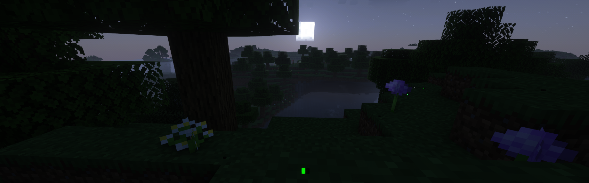
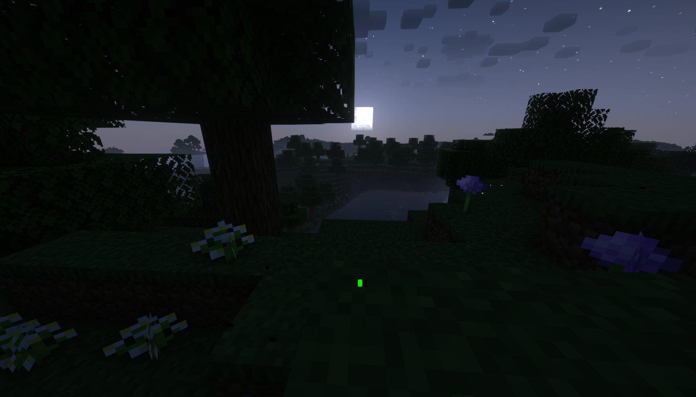
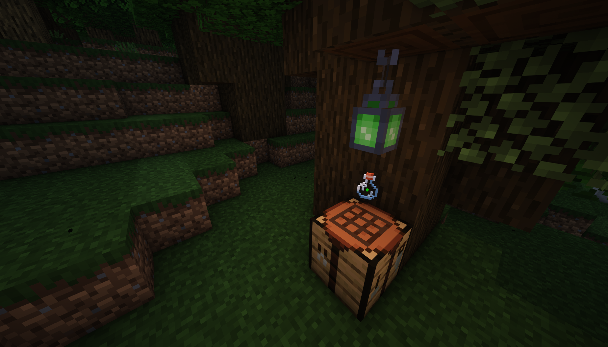

[![Mod loader: Fabric]][fabric]

## Mojang shouldn't have removed fireflies... Why not add them back, but better?

This mod adds the Colorfly , a new and improved Firefly entity for Minecraft. This isn't just a particle but rather a mob built from the ground up focused on ambiance and advanced interactions with the Vanilla Minecraft feeling.

Colorflies blink depending on the time of day, weather, and nearby entities! Maybe if you are a bit bored you can try to figure out what they are saying... *hint hint*

You can also capture the Colorflies! Carefully hold a glass bottle and right click them to safely store them for keeping. Then, whenever you want, craft them into a Colorfly Lantern!

Colorflies will spawn in semi large groups in certain biomes, so be on the lookout for flowers or places bugs might be to find them! But, be careful of Spiders! They don't like Colorflies very much...

*✨ It helps to search around at night since they will be luminescent/glowing ✨*

#### Keep an eye out for the rare Blue Ghost Colorfly! They seem to behave differently than a normal Colorfly and have recently settled into dark and forested regions...

## Screenshots

\

[fabric]: https://fabricmc.net
[Mod loader: Fabric]: https://img.shields.io/badge/modloader-Fabric-1976d2?style=plastic&logo=data:image/png;base64,iVBORw0KGgoAAAANSUhEUgAAACAAAAAgCAYAAABzenr0AAAACXBIWXMAAAsTAAALEwEAmpwYAAAFHGlUWHRYTUw6Y29tLmFkb2JlLnhtcAAAAAAAPD94cGFja2V0IGJlZ2luPSLvu78iIGlkPSJXNU0wTXBDZWhpSHpyZVN6TlRjemtjOWQiPz4gPHg6eG1wbWV0YSB4bWxuczp4PSJhZG9iZTpuczptZXRhLyIgeDp4bXB0az0iQWRvYmUgWE1QIENvcmUgNS42LWMxNDIgNzkuMTYwOTI0LCAyMDE3LzA3LzEzLTAxOjA2OjM5ICAgICAgICAiPiA8cmRmOlJERiB4bWxuczpyZGY9Imh0dHA6Ly93d3cudzMub3JnLzE5OTkvMDIvMjItcmRmLXN5bnRheC1ucyMiPiA8cmRmOkRlc2NyaXB0aW9uIHJkZjphYm91dD0iIiB4bWxuczp4bXA9Imh0dHA6Ly9ucy5hZG9iZS5jb20veGFwLzEuMC8iIHhtbG5zOmRjPSJodHRwOi8vcHVybC5vcmcvZGMvZWxlbWVudHMvMS4xLyIgeG1sbnM6cGhvdG9zaG9wPSJodHRwOi8vbnMuYWRvYmUuY29tL3Bob3Rvc2hvcC8xLjAvIiB4bWxuczp4bXBNTT0iaHR0cDovL25zLmFkb2JlLmNvbS94YXAvMS4wL21tLyIgeG1sbnM6c3RFdnQ9Imh0dHA6Ly9ucy5hZG9iZS5jb20veGFwLzEuMC9zVHlwZS9SZXNvdXJjZUV2ZW50IyIgeG1wOkNyZWF0b3JUb29sPSJBZG9iZSBQaG90b3Nob3AgQ0MgMjAxOCAoV2luZG93cykiIHhtcDpDcmVhdGVEYXRlPSIyMDE4LTEyLTE2VDE2OjU0OjE3LTA4OjAwIiB4bXA6TW9kaWZ5RGF0ZT0iMjAxOS0wNy0yOFQyMToxNzo0OC0wNzowMCIgeG1wOk1ldGFkYXRhRGF0ZT0iMjAxOS0wNy0yOFQyMToxNzo0OC0wNzowMCIgZGM6Zm9ybWF0PSJpbWFnZS9wbmciIHBob3Rvc2hvcDpDb2xvck1vZGU9IjMiIHBob3Rvc2hvcDpJQ0NQcm9maWxlPSJzUkdCIElFQzYxOTY2LTIuMSIgeG1wTU06SW5zdGFuY2VJRD0ieG1wLmlpZDowZWRiMWMyYy1mZjhjLWU0NDEtOTMxZi00OTVkNGYxNGM3NjAiIHhtcE1NOkRvY3VtZW50SUQ9InhtcC5kaWQ6MGVkYjFjMmMtZmY4Yy1lNDQxLTkzMWYtNDk1ZDRmMTRjNzYwIiB4bXBNTTpPcmlnaW5hbERvY3VtZW50SUQ9InhtcC5kaWQ6MGVkYjFjMmMtZmY4Yy1lNDQxLTkzMWYtNDk1ZDRmMTRjNzYwIj4gPHhtcE1NOkhpc3Rvcnk+IDxyZGY6U2VxPiA8cmRmOmxpIHN0RXZ0OmFjdGlvbj0iY3JlYXRlZCIgc3RFdnQ6aW5zdGFuY2VJRD0ieG1wLmlpZDowZWRiMWMyYy1mZjhjLWU0NDEtOTMxZi00OTVkNGYxNGM3NjAiIHN0RXZ0OndoZW49IjIwMTgtMTItMTZUMTY6NTQ6MTctMDg6MDAiIHN0RXZ0OnNvZnR3YXJlQWdlbnQ9IkFkb2JlIFBob3Rvc2hvcCBDQyAyMDE4IChXaW5kb3dzKSIvPiA8L3JkZjpTZXE+IDwveG1wTU06SGlzdG9yeT4gPC9yZGY6RGVzY3JpcHRpb24+IDwvcmRmOlJERj4gPC94OnhtcG1ldGE+IDw/eHBhY2tldCBlbmQ9InIiPz4/HiGMAAAAtUlEQVRYw+XXrQqAMBQF4D2P2eBL+QIG8RnEJFaNBjEum+0+zMQLtwwv+wV3ZzhhMDgfJ0wUSinxZUQWgKos1JP/AbD4OneIDyQPwCFniA+EJ4CaXm4TxAXCC0BNHgLhAdAnx9hC8PwGSRtAFVMQjF7cNTWED8B1cgwW20yfJgAvrssAsZ1cB3g/xckAxr6FmCDU5N6f488BrpCQ4rQBJkiMYh4ACmLzwOQF0CExinkCsvw7vgGikl+OotaKRwAAAABJRU5ErkJggg==